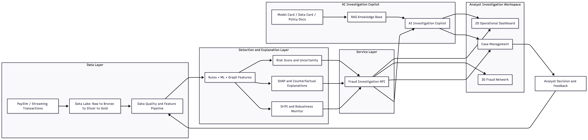

# FraudLens AI

FraudLens AI is a financial fraud detection and investigation project that I am building to practise end-to-end machine learning system design.

The goal is not only to train a model that predicts whether a transaction is fraudulent, but also to explore how a fraud detection system can support real analysts through risk scores, explanations, monitoring and human feedback.

This project is still in the early design stage. I plan to develop it step by step, starting from a baseline fraud detection model and gradually adding explainability, monitoring, case management and a future investigation dashboard.

## Why I am building this project

Many fraud detection projects stop at model training and evaluation. However, in real financial institutions, a model prediction alone is usually not enough. Analysts need to understand:

- why a transaction is considered risky
- which features contributed to the prediction
- whether the model is confident
- whether the case should be approved, reviewed or blocked
- how model decisions are recorded and audited

This project is designed to connect machine learning with a more realistic fraud investigation workflow.

## Project Goals

The project has two main goals.

### 1. Engineering goal

Build a practical machine learning system with:

- data processing pipeline
- feature engineering
- fraud detection model
- risk scoring API
- SHAP-based explanation
- basic monitoring
- case management workflow
- future dashboard and 3D fraud network view

### 2. Research goal

Use the project as a small research prototype to study explainability and robustness in fraud detection.

Main research question:

> Are explanations of fraud detection models stable and actionable under temporal distribution shift and adversarial transaction manipulation?

## Planned Features

The planned system includes:

- PaySim transaction data pipeline
- temporal train/test split
- rule-based fraud indicators
- machine learning fraud detection model
- risk score generation
- SHAP explanations
- uncertainty-aware review
- drift monitoring
- analyst case management
- human feedback loop
- model card and data card
- audit log
- future 3D fraud network investigation view
- future AI investigation copilot

## System Architecture

The following diagram shows the V1 conceptual architecture of FraudLens AI. It presents the main workflow from transaction data ingestion to fraud detection, investigation workspace, AI copilot and analyst feedback.




## Technology Stack

Planned tools and frameworks:

- Python
- Pandas
- NumPy
- scikit-learn
- XGBoost or LightGBM
- SHAP
- FastAPI
- MLflow
- Docker
- GitHub Actions
- Next.js
- TypeScript

## Repository Structure

```text
fraudlens-ai/
├── README.md
├── docs/
│   ├── system_design.md
│   └── research_proposal.md
├── data/
│   └── README.md
├── notebooks/
├── src/
│   ├── data/
│   ├── features/
│   ├── models/
│   ├── api/
│   └── monitoring/
├── frontend/
├── tests/
├── infrastructure/
├── requirements.txt
└── .gitignore
```

## Development Roadmap

### Phase 1: Baseline fraud detection

- prepare PaySim dataset
- clean transaction data
- create basic features
- train baseline models
- evaluate model performance
- generate SHAP explanations

### Phase 2: API and monitoring

- build FastAPI risk scoring endpoint
- add model version tracking
- add drift monitoring
- add basic audit log

### Phase 3: Investigation workflow

- design case management workflow
- add analyst feedback
- build simple dashboard
- show risk score and explanation together

### Phase 4: Research experiments

- test temporal distribution shift
- simulate adversarial transaction manipulation
- evaluate explanation stability
- compare review strategies under limited analyst capacity

## Current Status

Completed the first reproducible PaySim pipeline, including data validation, temporal split, feature engineering, baseline model training and evaluation.

The first diagnostic baseline achieved very high performance, but the results also reveal potential feature leakage from post-transaction balance fields and rule-derived variables. The next milestone is to build a stricter real-time baseline using only features that would be available before or during transaction review.
